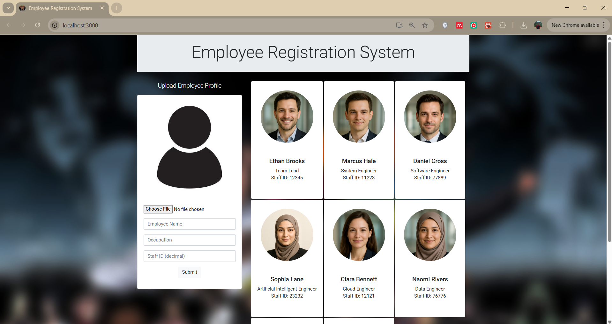

# 👨‍💼 Employee Registeration System

A fullstack application to register employees with image upload functionality, built using **React.js** for the frontend and **ASP.NET Core Web API** for the backend. SQL Server is used as the database with **Entity Framework Core** for ORM.

---

## 🚀 Features

- 📤 Upload an image in **React** and store it via **ASP.NET Core Web API**
- 🗂️ Full CRUD functionality for employee data
- 🖼️ Image preview before upload
- 🧰 SQL Server database with Entity Framework Core
- 🎯 Seamless integration between frontend and backend

---

## 🛠 Tech Stack

### Frontend
- React.js (with Hooks)
- Axios (for HTTP requests)
- Bootstrap or plain CSS (for styling)

### Backend
- ASP.NET Core Web API
- Entity Framework Core
- SQL Server

---

## 📸 Image Upload Flow

1. User selects an image using a file input form in React.
2. A preview of the selected image is displayed instantly.
3. On form submission, the image is sent to the ASP.NET Core Web API.
4. The Web API handles and saves the image to the server and stores the path in the database.
